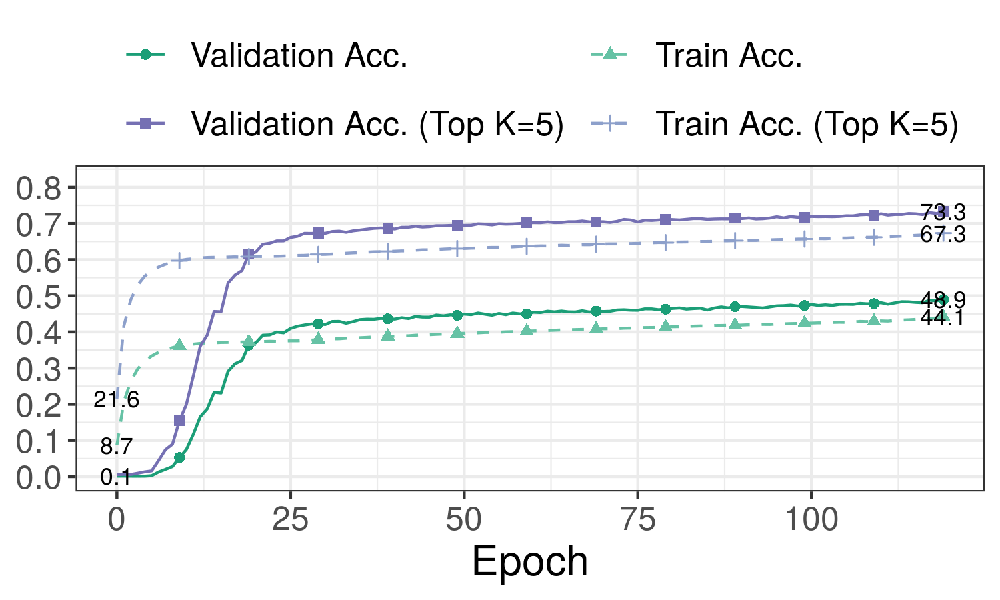

# Experiment Data

This folder contains our experiment for BaseNet_k_1.

### Source Code and Running Command

The complete code used is in the [src](src) folder.
The exact running command is saved in [run.sh](src/run.sh).
Please check the [Setup](../README.md#setup) on how to run the training.

### Log Files

In the [logs](logs) folder, you can find:

- [output logs](logs/training.log)
- [data CSV](logs/data.csv) (includes loss and accuracy during training and validation for each epoch)
- [training time](logs/time) (on our machines)

### Accuracy Curve

