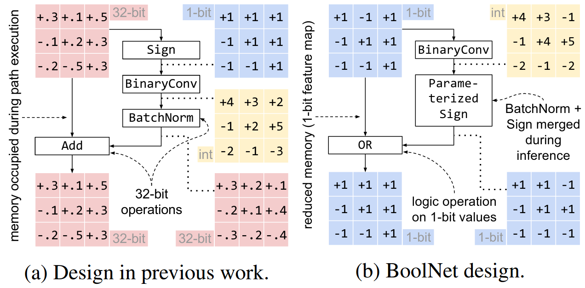

# BoolNet: Minimizing The Energy Consumption of Binary Neural Networks 

This is the accompanying code for our paper [BoolNet: Minimizing The Energy Consumption of Binary Neural Networks](https://arxiv.org/abs/2106.06991).
Here we provide the code and training details for our trainings from Section 4.5 "Comparison to State-of-the-Art BNNs".



## Setup

In any case you need to have a [CUDA setup](https://docs.nvidia.com/cuda/cuda-installation-guide-linux/index.html)
with a recent NVIDIA driver on your host system.
(We tested driver version 465.27 with support for CUDA 11.3, but drivers supporting CUDA 11.1 should be fine.)

Further you need to download and prepare the ImageNet dataset ([how?](https://stackoverflow.com/a/62253211)).

We use [enroot](#with-enroot) to provide an independent environment,
but you can install it [directly on your machine](#direct-install) instead.

### With Enroot
*(Last tested on: 2021-06-11)*

Install [enroot](https://github.com/NVIDIA/enroot) and
[libnvidia-container](https://github.com/nvidia/libnvidia-container) (for GPU support).

1. Import pytorch docker image into enroot and install the requirements.
```bash
enroot import -o pytorch.sqsh docker://pytorch/pytorch:1.8.1-cuda11.1-cudnn8-runtime
enroot create pytorch.sqsh
enroot start --root --rw -m ".":"/workspace" -- pytorch ./install.sh
```
2. (Optional) Repack the modified image (to have a clean image stored):
```bash
enroot export --output boolnet.sqsh pytorch
enroot remove pytorch && rm pytorch.sqsh
enroot create boolnet.sqsh
```
3. Select the experiment and run the corresponding training command (replace `boolnet` with `pytorch` if you did not do the previous step):
```bash
cd BaseNet_k_1
cd src
enroot start --rw -m "/path/to/imagenet/data":"/mnt/imagenet" -m ".":"/workspace" -e PYTHONPATH=/workspace -e PYTHONUNBUFFERED=x -- boolnet ./run.sh
```

### Direct Install

Please check our script `./install.sh` (designed for Ubuntu systems) to install the requirements needed
(in addition to the previously mentioned CUDA installation).
Please adapt the script accordingly for other operating systems (or use enroot instead).

After you have installed all requirements, simply copy and run the training command and add `--imagenet_directory /path/to/imagenet`:
```bash
cd BaseNet_k_1
cd src
cat run.sh # print the training command for copying
# paste the command, add the imagenet directory (--imagenet_directory ...) and run 
```

## Experiment details

We provide more details about our individual runs (log files, accuracy curves, etc.),
in the corresponding directories (or you can just use the links below):

| Method                            | Bit-width (W/A/F) | Energy Usage  | ImageNet Accuracy | Theoretical Operations |
|-----------------------------------|:-----------------:|:-------------:|:-----------------:|:----------------------:|
| [BoolNet*(k=4)](BoolNet_k_4_star) | 1/1/4             | **1.18mJ**    | **59.6%**         | 1.76 x 10^8            |
| [BoolNet(k=4)](BoolNet_k_4)       | 1/1/4             | **0.84mJ**    | **57.6%**         | 1.64 x 10^8            |
| [BaseNet(k=4)](BaseNet_k_4)       | 1/1/4             | **0.74mJ**    | **55.1%**         | 1.54 x 10^8            |
| [BaseNet(k=1)](BaseNet_k_1)       | 1/1/1             | **0.61mJ**    | **48.9%**         | 1.51 x 10^8            |

The bit-width refers to: W = weights, A = inputs (before convolutions), F = feature maps.
The details for the calculation of energy usage can be found in our paper.

## Contributing

Please feel free to open an issue or a pull request, if you encounter problems or want to provide suggestions.

## Cite

If you want to compare to our results or if our code has helped your research, we would be happy if you can cite us:
```
@misc{guo2021boolnet,
      title={BoolNet: Minimizing The Energy Consumption of Binary Neural Networks}, 
      author={Nianhui Guo and Joseph Bethge and Haojin Yang and Kai Zhong and Xuefei Ning and Christoph Meinel and Yu Wang},
      year={2021},
      eprint={2106.06991},
      archivePrefix={arXiv},
      primaryClass={cs.LG}
}
```
